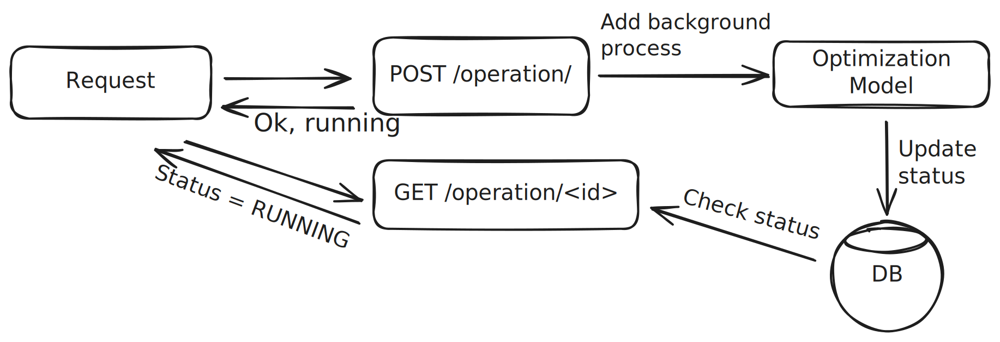

Recently I joined a new project to develop an optimization model for Linode's VM allocation problem. The problem can be summarized as a multi dimensional bin packing problem with extra constraints. We solve this problem using Mixed Integer Program (MIP). MIPs are used in many resource allocations problems, such as airline scheduling or logistics. 

Making the underlying optimization model available as a service is a big part of solving this whole problem. The optimization model is only useful if other services who are in charge of allocation operations (such as creating a new VM, migrating a VM etc.) can use it effectively. Here are the requirements for the service:

- Highly available API which runs the same underlying model on-demand with different sets of inputs using different endpoints
- Scheduled (such as every hour) runs where the results are published for other system's to lookup immediately
- Ability to make changes to the underlying model in much higher cadence since the company is just started to focus on the problem

I believe these set of requirements are very typical for a production grade service which exposes an underlying optimization model. In this post I will try to explain what are the bare minimums to implement such service.

## Backend Service Design

The only part that makes this service different than any other REST API backend is the fact that MIPs can take a long time. REST APIs typically shouldn't keep the requests waiting for too long. Instead, the underlying optimization model should be run as a background process and the client should have a way to check the status.

The very simple architecture looks like this:

The exact implementation of this depends on how much complexity you're willing to work with. 

## Testing

This is where the fun begins. Optimization models can be hard to debug, hard to understand, and hard to believe. Systematic approaches are necessary to allow development of them.

### Unit Tests

### Functional Tests

### Stress Tests

### Related Blog Posts / Articles

https://netflixtechblog.com/predictive-cpu-isolation-of-containers-at-netflix-91f014d856c7

https://www.nextmv.io/blog/the-road-to-production-is-paved-with-testing-and-experimentation

