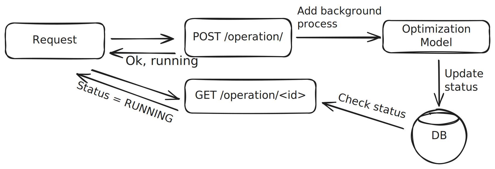

I recently joined a new project to develop an optimization model for Linode's Virtual Machine allocation system which can be summarized as a dynamic multi-dimensional bin packing problem where the items are VMs and the bins are hosts. We approach this problem using a Mixed Integer Program (MIP). Developing the MIP for this problem showed me the very interesting world of operations research and optimization. In this blog post, I will explains the bare minimum requirements for developing an optimization model in a production environment. I am most familiar with resource allocation problems and using MIPs, so this post is definitely more relevant for someone who is also working on a similar problem. If you are not familiar with MIPs, you can read [this article](https://www.gurobi.com/resources/mixed-integer-programming-mip-a-primer-on-the-basics/) by Gurobi which explains the basics very well.  MIPs are used in many resource allocation problems, such as airline scheduling or logistics. Learning about them will certainly give you a new aspect in approaching optimization.

Developing this kind of an optimization model generally has two steps. First, you develop the model and show that it works on a small problem. Then, you build tooling to simulate the model's behavior in production, showing the pros and cons, trying to make sure everything is as you expected while also trying to show a case for such service in your organization.

If you can show some improvement (and convince people) then the next step is to create a way to develop the model in the long run, make it robust by working on tooling and tests, and finally wrap it nicely into a service. Making the underlying optimization model available as a service is a big part of this journey. Since you're optimizing an existing system, it is almost certain that the existing infrastructure will need to communicate with this optimization service (while making changes/decisions). The optimization model is only useful if others services can consume the results within a reasonable time.

Requirements for such a service may include:

- A highly available API running the underlying optimization model on demand, providing various endpoints for a variety of use cases.
- Scheduled runs (e.g., every hour) which publish results from the optimization model for other systems to look up easily.
- Ability to make changes to the underlying model without distrupting the production service.

Let's start with the basics of the backend service and then I'll focus on what is needed to keep it running in the long term.

## Backend service design for long running processes

APIs typically shouldn't keep requests waiting for too long. Unfortunately, MIPs don't always play nicely in the sandbox. MIPs may take a long time solving the problem and predicting the solution time is not always easy, given the complexity of the problem is different for each set of inputs. If the API waits for the result of the model, the response time would vary a lot and the failures would be hard to debug. Instead, the underlying optimization model should run as a background process and the client should have a way to check its status.

The simplified architecture of a long running operation would look like this:

To learn more about long running processes, you can check out the [API Design Patterns](https://www.manning.com/books/api-design-patterns) book by JJ Geewax which has a "Long-running operations" section covering the basics for this kind of use case.

In addition to the long running process architecture, there are a couple more things to watch out for while developing a service on top of an optimization model.

First, make sure you limit the duration of the runs. The underlying problem can get very complex and may result in unexpected run times. Failing at a reasonable time (which depends heavily on your problem) allows you to retry with different configurations and allows the users of the service to consider alternative ways to deal with the lack of your optimization model. 

Second, implement retry strategies with varying MIP gap levels. There are cases where it makes sense to compromise the solution quality a little just to get a solution.

Third, log everything. Make sure you capture the inputs as they enter your model and store them somewhere for later debugging. Most optimization packages nowadays have functionality to save a state of the optimization model to be loaded exactly if needed. If that's not available, keeping everything in a file format that you can later load just works fine. Make sure to monitor the solve times and consider writing alerts for them (especially for models that run on a schedule).

Lastly, monitor memory and CPU consumption closely. I'd recommend this for all production services but MIPs require extra care. Make sure your deployment mechanism is flexible enough to increase memory and cores in the future if necessary (more on this in the "stress testing" section below). For example, if you're deploying using a container system that only provisions 8GB of memory (smh), you really want to make sure your model will fit it even after a couple years down the line.

## Testing Optimization Models

This is where the fun begins. Optimization models can be hard to debug. Systematic approaches are necessary to allow consistent development of them. As a software engineer, I find it easier to think these tests in terms of traditional tests used in software engineering.

### Unit Tests 

MIPs comprise sets, parameters, variables, constraints, and an objective function. Each of these components are constructed using "code", which needs testing. You'll likely need to manipulate input data to match the formatting required by the optimization model. Unit tests come into the picture at this phase to make sure the manipulation of the inputs are done correctly.

Utilizing concepts like [table driven tests](https://go.dev/wiki/TableDrivenTests) may help to get there faster.

### Functional Tests

How do you know your model works? Is it making the right decisions? Functional tests help to set a good foundation for the basic functionality of the optimization model. 

The best way I found to conduct functional tests in this context so far is to understand the fundamental problems that your model is solving and generate small examples of them. For example, if you're working on a bin packing problem, start with the very simple example of 2 bins and a couple of items. Compute the best possible allocation manually and keep them in [golden files](https://softwareengineering.stackexchange.com/questions/358786/what-are-golden-files). For more advanced "golden files", it helps to use the model first and vet the output. However, it is very easy to be tricked by a slightly wrong model output as it is quite hard for us humans to solve these problems manually. 

Lastly, add tests which go through these golden files, run the model, and expect the same output. These become extremely useful to be confident about changes to the model down the line. 

### Stress Tests

It is great that your model works today! What about in a year? Your business is (hopefully) growing quickly so the problem becomes more challenging for the optimization model every day. Assuming no improvements in the model, can it run for the upcoming years? Well, you need to scale up the inputs and see. 

Unfortunately there is no clear recipe for this kind of tests since every problem scales up in a different way. Therefore the first step is to figure out what's likely to grow and what's not, and just test for the worst case. As MIPs don't always scale well it may be very discouraging to see long run-times for your optimization model. Facing the reality with stress tests is hard but very productive. They often show you the weakest parts of the optimization model and help you to improve them. 

Make sure you stress test your optimization model according to your problem's grow rate to be prepared for the issues in the future.

## Wrapping up

Mixed integer programming is a very powerful technique to solve problems while expressing business goals in a simple way. As long as they are planned and executed well, they can serve a variety of use cases. However, they need extra care as the time and resources it takes to solve the problem may be unpredictable. Maintaining them in the long run requires some tooling and specialized testing. In this blog post I covered the basics of developing a service that runs a mixed integer program under the hood. I showed an example architecture for the API and talked about things that may need extra care. I explained techniques that can be used for testing mixed integer programs which is a requirement for efficient development.

## Helpful links

I find it hard to find good content on MIPs in general but I think the following links are extremely valuable:

[1.1: Intro to LP and MIP](https://www.youtube.com/watch?v=i1wg23MFA5I&list=PLaoe2MTbJBvpFPyMMSOB-WrHofdHo3e74&ab_channel=MikeWagner) (best introduction to LP and MIP for a software engineer that I could find)

[The road to production is paved with testing and experimentation](https://www.nextmv.io/blog/the-road-to-production-is-paved-with-testing-and-experimentation)

[Testing...testing...1, 2, 3](https://www.nextmv.io/blog/testing-testing-1-2-3) (on testing optimization model)

[Predictive CPU isolation of containers at Netflix](https://netflixtechblog.com/predictive-cpu-isolation-of-containers-at-netflix-91f014d856c7) (good use of MIP in production)