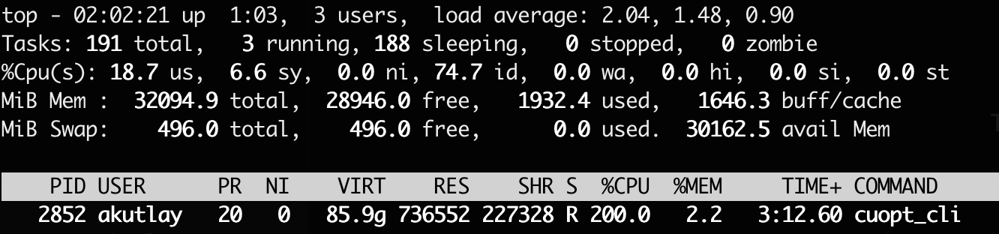

NVIDIA announced their GPU acceralated PDLP implementation last year. The announcement included benchmarking results for a set of problems from [MIPLIB benchmark library](https://miplib.zib.de/) and claimed to be faster than the state-of-the-art CPU LP in 60% of the problems.

However, this new method comes with challenges. The initial announcement mentioned convergence issues and lower accuracy in some of the problems. Other people reported similar concerns: [HiGHS Newsletter](https://highs.dev/assets/HiGHS_Newsletter_25_0.pdf), [FICO Blog](https://www.fico.com/blogs/gpu-powered-optimization-nvidia-cuopt).

What's more exciting about CuOpt is their commitment to open source. Since the announcement, CuOpt is [open sourced](https://github.com/NVIDIA/cuopt) and also added to the COIN-OR repository, which also keeps a [mirror](https://github.com/coin-or/cuopt/).

In this blog post, I will give a simple guide to get started with CuOpt and share my first impressions.

## Finding a GPU

You guessed it, you need an NVIDIA GPU with CUDA support and your $2000 MacBook is pretty useless here. 

I use a [Linode GPU instance with RTX4000 Ada GPU](https://www.linode.com/pricing/#compute-gpu) from Linode (as I work there) which costs $0.52/hour. I also use [Linode Images](https://techdocs.akamai.com/cloud-computing/docs/capture-an-image) which is useful to save money while not using the GPU. Linode Images makes it easy to delete and create the same Linode without losing the NVIDIA drivers and the disk.

## Installation

Installing CuOpt is pretty simple. However, this was my first time dealing with CUDA, so I had to search around a bit to get the right drivers installed. I prepared a small Github repository to share 3 scripts you can simply copy paste to get your machine working with necessary drivers and CuOpt installed: https://github.com/kutlay/getting-started-with-cuopt These scripts are tested on a Ubuntu 24.04 Linode GPU instance. Installation takes about ~15 minutes.

## First try

I wanted to see the utilization of the GPU & CPU so I downloaded a good sized problem from the MIPLIB benchmark set: [trimtip1](https://miplib.zib.de/instance_details_triptim1.html). The problem has around ~30k variables and ~15k constraints.

I used the CuOpt CLI to solve the model: `cuopt_cli triptim1.mps --mip-absolute-gap 0.05 --time-limit 100`

The GPU was under 100% load for the full duration of the solve:

(Screenshot from `nvidia-smi` under load)

Where as the CPU was only using 2-cores out of 16 I had:

(Screenshot from `top` under load, interesting VIRT number there)

