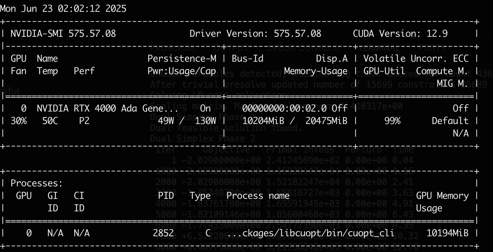
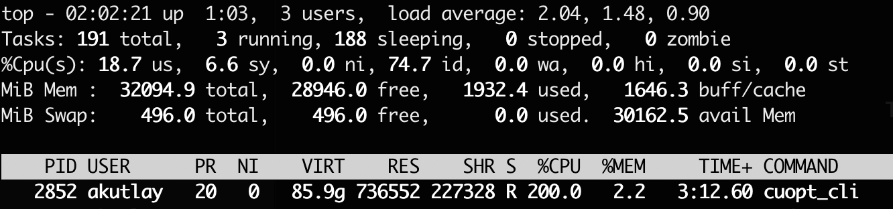

(This blog post later got published on <a href="https://www.akamai.com/blog/cloud/how-to-get-started-nvidia-cuopt">Akamai Blog</a>)

NVIDIA announced its GPU accelerated PDLP implementation last year. The announcement included benchmarking results for a set of problems from [MIPLIB benchmark library](https://miplib.zib.de/) and claimed to be faster than the state-of-the-art CPU-based LP solver in 60% of the problems.

However, this new method comes with challenges. The initial announcement mentioned convergence issues and lower accuracy in some of the problems. Other sources, such as the [HiGHS Newsletter](https://highs.dev/assets/HiGHS_Newsletter_25_0.pdf) and the [FICO Blog](https://www.fico.com/blogs/gpu-powered-optimization-nvidia-cuopt), have echoed similar concerns.

What's more exciting about CuOpt is their commitment to open source. Since the announcement, CuOpt has been [open-sourced](https://github.com/NVIDIA/cuopt) and added to the COIN-OR repository, which also maintains a [mirror](https://github.com/coin-or/cuopt/).

In this blog post, I will give a simple guide to get started with CuOpt and share my first impressions.

## Finding a GPU

You guessed it, you need an NVIDIA GPU with CUDA support.

I use a [Linode GPU instance with RTX4000 Ada GPU](https://www.linode.com/pricing/#compute-gpu) (I work at Akamai), which costs $0.52/hour. I also use [Linode Images](https://techdocs.akamai.com/cloud-computing/docs/capture-an-image) to save money when the GPU is not in use. Linode Images allow you to delete and recreate the same instance without losing the NVIDIA drivers or disk data.

## Installation

Installing CuOpt is pretty simple. However, this was my first time dealing with CUDA, so I had to search around a bit to get the right drivers installed. I prepared a small Github repository to share 3 scripts you can simply copy&paste to get your machine working with necessary drivers and CuOpt installed: [kutlay/getting-started-with-cuopt](https://github.com/kutlay/getting-started-with-cuopt) These scripts are tested on an Ubuntu 24.04 Linode GPU instance. Installation takes about ~15 minutes.

## First try

I wanted to see the utilization of the GPU & CPU so I downloaded a good sized problem from the MIPLIB benchmark set: [trimtip1](https://miplib.zib.de/instance_details_triptim1.html). The problem has ~30k variables and ~15k constraints.

I used the CuOpt CLI to solve the model: `cuopt_cli triptim1.mps --mip-absolute-gap 0.05 --time-limit 100`

The GPU was under 100% load for the full duration of the solve:


(Screenshot from `nvidia-smi` under load)

Whereas the CPU was only using 2-cores out of 16 I had:


(Screenshot from `top` under load, interesting VIRT number there)

## Doubling the GPUs

Over the past decade, CPU clock speeds have plateaued (generally staying under ~5 GHz), mainly due to power and thermal limits. This limits the improvements in mathematical solvers over the years, since most of the improvements are achieved by advancements in heuristics. PDLP changed this by making use of parallelism to a much greater degree. The rapid growth of AI has shown how powerful parallelism can be, especially when scaling across GPU clusters. GPU-accelerated solvers are exciting because performance can now improve year over year due to hardware advancements, allowing models to scale faster over time.

I've been looking for some evidence whether CuOpt scales well with simply using more (or faster) GPUs. One piece of evidence I found is from [Mittelmann LP benchmark results on June 22nd, 2025](https://web.archive.org/web/20250624111618/https://plato.asu.edu/ftp/lpfeas.html) which tested six very large LP problems on two different GPUs and reported the time to solve each problem (in seconds).

```
                             RTX A6000                    H100
                       ---------------------------------------------
problem                cuPDLP      cuOpt         cuPDLP        cuOpt
=====================================================================
heat_250_10_500_200     13898      18904           7288         4611
heat_250_10_500_300     10184      11323           3696         4384
heat_250_10_500_400      5420       5124           3014         3233
mcf_2500_100_500         4859      14855           1166         1381
mcf_5000_50_500          5797       8403           2260        10134
mcf_5000_100_250        19584       8657           1461         2139
=====================================================================
dimensions           constraints       variables        nonzeros
heat*                 15625000          31628008       125000000
mcf_2500_100_500       1512600         126250100       253750100
mcf_5000_100_250       1775100         127500100       257500100
mcf_5000_50_500        2775050         126250050       253750050
```

These cards seem hard to compare but in various different benchmarks ([1](https://bizon-tech.com/gpu-benchmarks/NVIDIA-A100-80-GB-(PCIe)-vs-NVIDIA-H100-NVL-(PCIe)-vs-NVIDIA-RTX-6000-Ada/624vs632vs640?srsltid=AfmBOoo8FqbJjd3OJokPvI04tmFS0Hx-xz-moEiZrdu9W6XL4E0d8n0n), [2](https://forums.developer.nvidia.com/t/performance-of-6000-ada-vs-h100-for-multi-modal-object-detection-training/315835?utm_source=chatgpt.com), [3](https://www.naddod.com/blog/comparing-nvidia-top-ai-gpus-h100-a100-a6000-and-l40s?srsltid=AfmBOopdWp1CtNAwINk48ynz3sMoZlu-RT4BvDaC0LN1O9MShHv1hGw6&utm_source=chatgpt.com)) H100 performs at least 2x better than RTX A6000. Price wise, H100 was roughly 5 times more expensive than RTX A6000. Keeping these in mind, the benchmark results from Mittelmann seem promising as H100 was between 2x and 6x faster than RTX A6000 (except for one of the problems).

The problems chosen for the above benchmarks are very large and may not apply to a lot of fields where mathematical solvers are used. It is hard to say what types of problems would benefit how much from a larger GPU. I encourage everyone to try CuOpt with different cards and observe how the scaling works for their problem. 

## Conclusion

GPUs are changing the way we solve problems. Many problem domains have already benefited from GPU acceleration, and now it's time for mathematical solvers to benefit as well. I appreciate NVIDIA's strategy to open-source CuOpt and advance the field with a strong product. I also expect commercial solvers will aim to surpass CuOpt, ultimately providing users with even more powerful tools in the future.